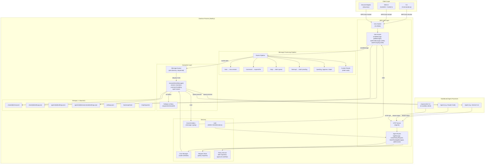
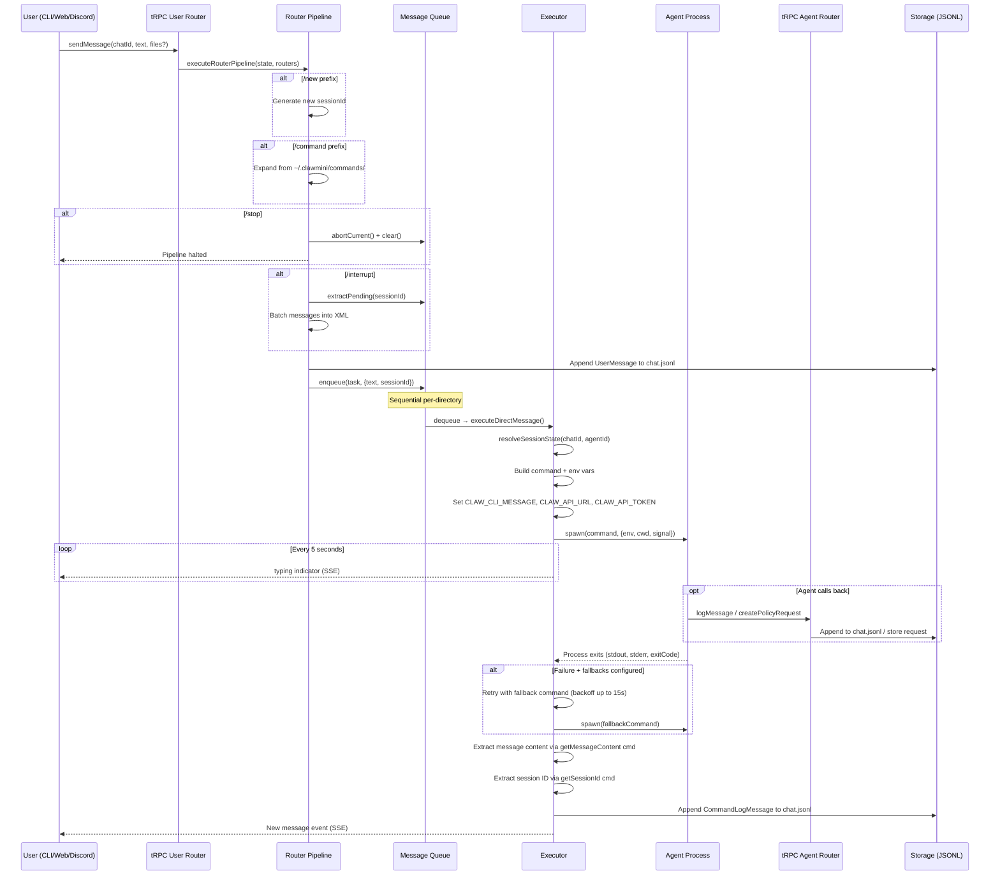
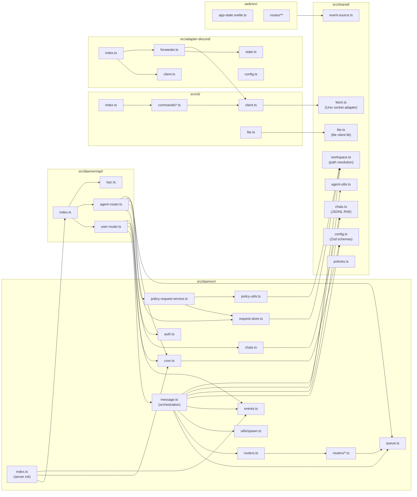

# Clawmini Architecture

## Overview

Clawmini is a **secure, local-first orchestrator for AI agents**. It provides sandboxing, multi-channel chat interfaces (CLI, Web, Discord), persistent conversation sessions, cron scheduling, and a human-in-the-loop policy approval system. It does **not** run its own LLM — instead it spawns external CLI-based agents (Gemini CLI, Claude Code, etc.) as child processes.

---

## High-Level Architecture



---

## Concurrency & Conversation Model

```mermaid
graph TB
    subgraph ConcurrencyModel["Concurrency Model"]
        direction TB

        subgraph Dir1["Directory /workspace-A"]
            Q1["Queue (sequential)"]
            Q1_M1["msg1 → processing"]
            Q1_M2["msg2 → pending"]
            Q1_M3["msg3 → pending"]
            Q1 --> Q1_M1
            Q1_M1 -.->|waits| Q1_M2
            Q1_M2 -.->|waits| Q1_M3
        end

        subgraph Dir2["Directory /workspace-B"]
            Q2["Queue (sequential)"]
            Q2_M1["msg1 → processing"]
            Q2_M2["msg2 → pending"]
            Q2 --> Q2_M1
            Q2_M1 -.->|waits| Q2_M2
        end
    end

    NOTE["Queues are keyed by directory (cwd).<br/>Messages within a queue run sequentially.<br/>Different directories run concurrently."]

    style NOTE fill:#ffffcc,stroke:#cccc00
```



**Key findings on the conversation threading model:**

- **Not multi-threaded** in the OS sense. The daemon is a single Node.js process.
- **Per-directory sequential queues**: A `Map<string, Queue>` keyed by the working directory (`cwd`). Messages targeting the same directory are processed one at a time, in order.
- **Cross-directory concurrency**: Messages targeting *different* directories execute concurrently since they use separate queue instances.
- **Per-chat sessions**: Each `(chatId, agentId)` pair maps to a single session. The session ID is reused across messages to maintain conversation context.
- **`/new` creates a fresh session** — generates a new `sessionId` via `crypto.randomUUID()`.
- **`/interrupt` batches pending messages** — extracts queued messages for the current session and merges them into a single XML-wrapped message.

This design **prioritizes conversation consistency** over parallelism. A single agent process runs at a time per workspace, preventing race conditions on session files and ensuring ordered context.

---

## Message Lifecycle



---

## Module Dependency Map



---

## Storage Layout

```
~/.clawmini/
├── settings.json                         # Global config (defaultAgent, environments, routers, api)
├── daemon.sock                           # Unix socket for CLI/Web communication
├── agents/
│   └── {agentId}/
│       ├── settings.json                 # Agent config (commands, env, fallbacks)
│       └── sessions/
│           └── {sessionId}/
│               └── settings.json         # Per-session env overrides
├── chats/
│   └── {chatId}/
│       ├── chat.jsonl                    # Message history (UserMessage | CommandLogMessage)
│       └── settings.json                 # Chat config (defaultAgent, routers, jobs)
├── commands/
│   └── {name}.md                         # Slash command expansions
├── environments/
│   └── {envId}/
│       └── env.json                      # Sandbox config (init, up, down hooks, env vars)
└── tmp/
    ├── requests/
    │   └── {id}.json                     # Pending policy approval requests
    ├── snapshots/
    │   └── {file}-{random}               # File snapshots for policy requests
    └── discord/
        └── {file}                        # Downloaded Discord attachments
```

---

## Key Design Decisions

| Decision | Rationale |
|----------|-----------|
| **Per-directory sequential queues** | Prevents race conditions on session files; maintains ordered conversation context |
| **Agent-as-child-process** | Clean isolation; any CLI tool can be an agent; no LLM coupling |
| **HMAC token auth for agents** | Stateless, per-session tokens; no need for persistent credentials |
| **JSONL chat storage** | Append-only, simple, no database dependency |
| **Router pipeline pattern** | Composable message preprocessing; custom routers via shell scripts |
| **File snapshots for policies** | Immutable copies prevent TOCTOU attacks on policy approval |
| **SSE for real-time updates** | Simple, unidirectional streaming; no WebSocket complexity |
